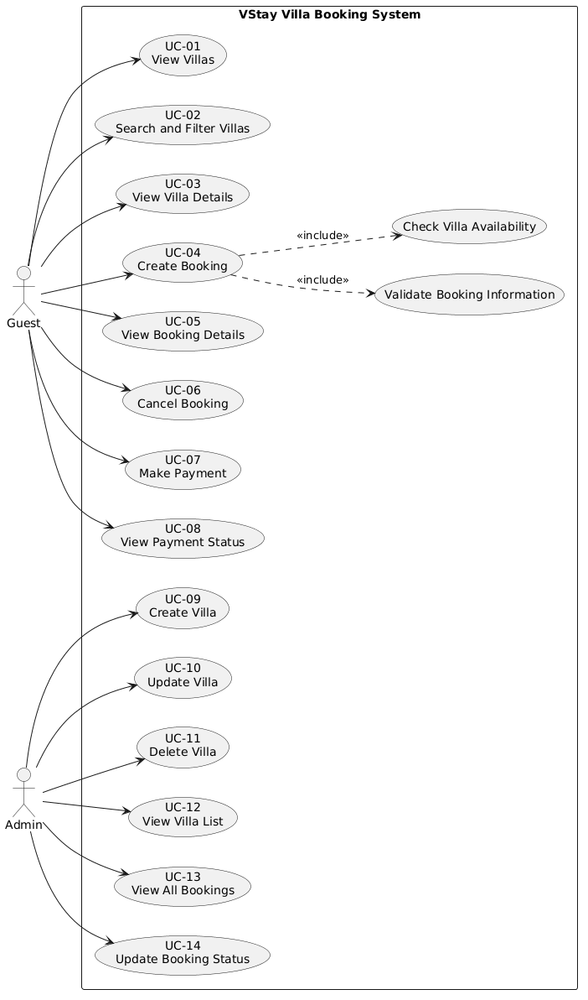
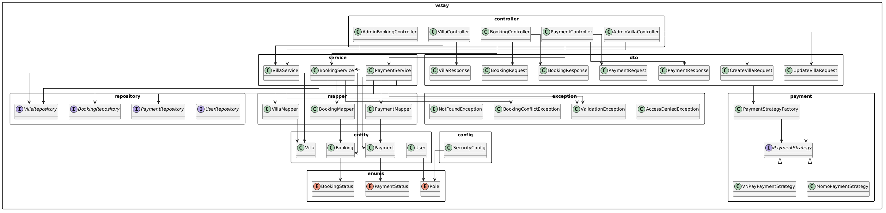
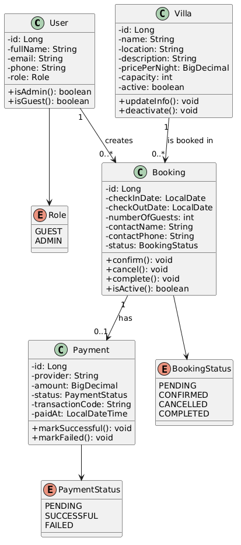

# VStay - Villa Booking System

VStay is a small villa booking system created for a Software Design assignment. This repository is mainly used to show the full process of analyzing, designing, documenting, and implementing a simple booking backend.

The project is not a commercial booking product. It is an academic project that demonstrates requirements analysis, UML modeling, design patterns, API design, and a Spring Boot backend prototype.

## What This Repository Contains

- Software design documents in `docs/md`
- PlantUML diagram source files in `docs/uml`
- Generated UML images in `report/assets`
- Final English PDF report in `report/pdf`
- Spring Boot backend source code in `backend`
- Docker Compose setup for running the backend locally

## System Overview

VStay has two main user roles:

| Role | Main Actions |
| --- | --- |
| Guest | Browse villas, search/filter villas, view villa details, create bookings, cancel bookings, make payments, and view payment status. |
| Admin | Create, update, delete, and view villas; view bookings; update booking status. |

The system focuses on core booking workflows only. Features such as chat, loyalty points, AI recommendations, mobile app support, and complex financial reporting are outside the assignment scope.

## Diagrams

### Use Case Diagram



### Package Diagram



### Class Diagram



More diagrams are available in:

- PlantUML source: `docs/uml`
- Generated images: `report/assets`
- Full report: `report/pdf/vstay-report-en.pdf`

## Backend Overview

The backend is implemented with Java and Spring Boot. It provides REST APIs for villa browsing, booking management, simplified payment, and admin management.

Main backend packages:

| Package | Purpose |
| --- | --- |
| `controller` | Defines public, guest, payment, and admin REST endpoints. |
| `service` | Contains business logic such as booking validation, availability checks, payment handling, and status updates. |
| `repository` | Uses Spring Data JPA to access stored data. |
| `entity` | Contains domain entities such as `User`, `Villa`, `Booking`, and `Payment`. |
| `dto` / `mapper` | Keeps API request/response data separate from database entities. |
| `payment` | Implements payment strategies for providers such as MOMO and VNPAY. |
| `exception` | Handles validation, not-found, conflict, and access-denied errors. |

Design patterns used in the backend:

- Layered Architecture
- Repository Pattern
- DTO and Mapper Pattern
- Strategy Pattern
- Factory Pattern

## Tech Stack

- Java 25
- Spring Boot 4.0.6
- Maven
- Spring Data JPA
- Spring Security with HTTP Basic Auth
- H2 in-memory database for local demo
- OpenAPI / Swagger UI
- Docker Compose
- PlantUML for diagrams
- LaTeX for final report

## Run Locally With Docker

Prerequisite:

- Docker Desktop

From the repository root:

```powershell
docker compose up --build
```

The backend will run at:

```text
http://localhost:8080
```

Swagger UI:

```text
http://localhost:8080/swagger-ui.html
```

OpenAPI JSON:

```text
http://localhost:8080/v3/api-docs
```

Stop the app:

```powershell
docker compose down
```

## Run Locally With Maven

Prerequisites:

- Java 25 or a compatible JDK
- Maven, or the included Maven Wrapper

From the backend folder:

```powershell
cd backend
.\mvnw.cmd spring-boot:run
```

Run tests:

```powershell
cd backend
.\mvnw.cmd test
```

## Demo Accounts

The demo backend uses HTTP Basic Auth.

| Role | Username | Password |
| --- | --- | --- |
| Guest | `guest@vstay.local` | `guest123` |
| Guest | `otherguest@vstay.local` | `guest456` |
| Admin | `admin@vstay.local` | `admin123` |

Public villa endpoints do not require authentication. Booking, payment, and admin endpoints require Basic Auth.

## Test The API

### Option 1: Swagger UI

Open:

```text
http://localhost:8080/swagger-ui.html
```

Use the Swagger page to view endpoints and send test requests directly from the browser.

### Option 2: Postman

Use this base URL:

```text
http://localhost:8080
```

For protected endpoints:

1. Open the request in Postman.
2. Go to the `Authorization` tab.
3. Choose `Basic Auth`.
4. Enter one of the demo accounts.
5. Send the request with JSON body if needed.

Example request:

```http
GET http://localhost:8080/api/villas
```

Example create booking request:

```http
POST http://localhost:8080/api/bookings
Authorization: Basic guest@vstay.local / guest123
Content-Type: application/json
```

```json
{
  "villaId": 2,
  "checkInDate": "2026-08-01",
  "checkOutDate": "2026-08-03",
  "numberOfGuests": 3,
  "contactName": "Demo Guest",
  "contactPhone": "0900000001"
}
```

### Option 3: DogAPI / HTTP Client

You can also test with DogAPI, Hoppscotch, Insomnia, or any HTTP client.

Use:

- Base URL: `http://localhost:8080`
- Auth type: Basic Auth
- Content type for POST/PUT/PATCH: `application/json`

## Useful API Paths

| Feature | Method / Path |
| --- | --- |
| List villas | `GET /api/villas` |
| View villa details | `GET /api/villas/{id}` |
| Create booking | `POST /api/bookings` |
| View booking | `GET /api/bookings/{id}` |
| Cancel booking | `POST /api/bookings/{id}/cancel` |
| Make payment | `POST /api/payments` |
| View payment status | `GET /api/payments/booking/{bookingId}` |
| Admin list villas | `GET /api/admin/villas` |
| Admin create villa | `POST /api/admin/villas` |
| Admin update villa | `PUT /api/admin/villas/{id}` |
| Admin delete villa | `DELETE /api/admin/villas/{id}` |
| Admin list bookings | `GET /api/admin/bookings` |
| Admin update booking status | `PATCH /api/admin/bookings/{id}/status` |

More details are documented in `docs/technical/API.md`.

## Repository Structure

```text
.
|-- README.md
|-- docker-compose.yml
|-- backend/
|   |-- src/
|   |-- pom.xml
|   |-- Dockerfile
|   `-- mvnw.cmd
|-- docs/
|   |-- md/          # analysis and design documents
|   |-- technical/   # API and implementation overview
|   `-- uml/         # PlantUML diagram sources
|-- report/
|   |-- assets/      # generated UML images
|   |-- pdf/         # final PDF report
|   `-- vstay-report-en.tex
`-- scripts/
    `-- generate-uml-images.ps1
```

## Regenerate UML Images

The repo includes a helper script to generate PNG images from PlantUML files:

```powershell
powershell -ExecutionPolicy Bypass -File .\scripts\generate-uml-images.ps1
```

Generated images are written to:

```text
report/assets
```

## Project Status

The project currently includes completed requirements, UML diagrams, design pattern documentation, backend implementation, API documentation, generated diagram images, and a final English PDF report.
