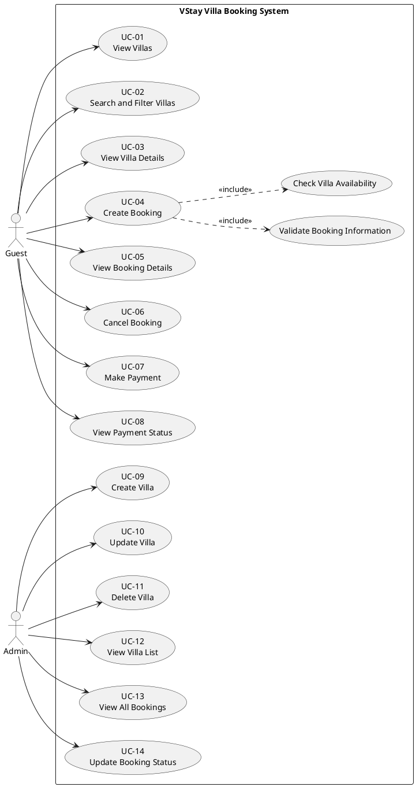

# 03 — Use Case Diagram Description

## Purpose

This document describes the use case diagram of the VStay Villa Booking System.
The purpose of the diagram is to identify the major actors and system interactions
before moving to class diagrams, sequence diagrams, and implementation planning.

The use case model is based on the requirements specification document.

---

# Related Requirements

- FR-01 → FR-20
- BR-01 → BR-12

---

# Primary Actors

| Actor | Description |
|---|---|
| Guest | A user who browses villas, creates bookings, cancels bookings, makes payments, and checks booking details. |
| Admin | A user who manages villas and booking status. |

---

# Major Use Cases

| Use Case ID | Use Case Name | Actor |
|---|---|---|
| UC-01 | View Villas | Guest |
| UC-02 | Search and Filter Villas | Guest |
| UC-03 | View Villa Details | Guest |
| UC-04 | Create Booking | Guest |
| UC-05 | View Booking Details | Guest |
| UC-06 | Cancel Booking | Guest |
| UC-07 | Make Payment | Guest |
| UC-08 | View Payment Status | Guest |
| UC-09 | Create Villa | Admin |
| UC-10 | Update Villa | Admin |
| UC-11 | Delete Villa | Admin |
| UC-12 | View Villa List | Admin |
| UC-13 | View All Bookings | Admin |
| UC-14 | Update Booking Status | Admin |

---

# AI Prompt Used

```text
Create a UML use case diagram for a villa booking management system.

Requirements:
- Guests can view villas, search villas, view villa details,
create bookings, cancel bookings, make payments, and view payment status.
- Admins can create, update, delete, and manage villas and bookings.

Generate a PlantUML use case diagram using Guest and Admin actors.
Keep the diagram simple and suitable for a university software engineering assignment.
```

---

# AI Generated UML Code



---

# UML Diagram Image

```text
assets/use-case-diagram.png
```

---

# Short Explanation

The use case diagram models the major interactions between system actors and the
VStay Villa Booking System.

The Guest actor focuses on villa browsing, booking management, and payment actions.

The Admin actor focuses on villa management and booking administration.

The diagram intentionally avoids advanced commercial features to remain aligned
with the project scope and university assignment constraints.

The "Create Booking" use case includes booking validation and villa availability
checking because these behaviors are mandatory parts of the booking workflow.

---

