# 003 — Package Diagram Description

## Purpose

This document describes the package diagram of the VStay Villa Booking System.

The package diagram explains how the backend source code is organized into clear layers and modules. It is designed to support the main use cases defined in the use case diagram, including villa browsing, booking management, payment processing, and admin management.

The architecture follows a layered Spring Boot structure to keep the system maintainable, readable, and implementation-ready.

---

# Related Use Cases

| Use Case ID | Use Case Name | Related Package |
|---|---|---|
| UC-01 | View Villas | controller, service, repository, entity, dto |
| UC-02 | Search and Filter Villas | controller, service, repository, dto |
| UC-03 | View Villa Details | controller, service, repository, dto |
| UC-04 | Create Booking | controller, service, repository, entity, dto, exception |
| UC-05 | View Booking Details | controller, service, repository, dto |
| UC-06 | Cancel Booking | controller, service, repository, entity |
| UC-07 | Make Payment | controller, service, repository, payment strategy |
| UC-08 | View Payment Status | controller, service, repository, dto |
| UC-09 | Create Villa | controller, service, repository, dto |
| UC-10 | Update Villa | controller, service, repository, dto |
| UC-11 | Delete Villa | controller, service, repository, exception |
| UC-12 | View Villa List | controller, service, repository |
| UC-13 | View All Bookings | controller, service, repository |
| UC-14 | Update Booking Status | controller, service, repository, entity |

---

# AI Prompt Used

```text
Create a UML package diagram for a Spring Boot villa booking management system.

The system includes:
- Villa browsing and searching
- Booking creation, cancellation, and status management
- Payment processing using MomoPay and VNPay
- Admin management for villas and bookings

Use a layered architecture with controller, service, repository, entity, dto, mapper, exception, and config packages.

Include Strategy Pattern and Factory Pattern for payment processing.
Generate the diagram using PlantUML.
Keep the diagram suitable for a university software engineering assignment and implementation-ready.
```

---

# AI Generated UML Code

```plantuml
@startuml
skinparam packageStyle rectangle
skinparam shadowing false
skinparam linetype ortho

package "vstay" {

  package "controller" {
    class VillaController
    class BookingController
    class PaymentController
  }

  package "service" {
    class VillaService
    class BookingService
    class PaymentService

    class PaymentStrategyFactory

    interface PaymentStrategy

    class MomoPaymentStrategy
    class VNPayPaymentStrategy
  }

  package "repository" {
    interface UserRepository
    interface VillaRepository
    interface BookingRepository
    interface PaymentRepository
  }

  package "entity" {
    class User
    class Villa
    class Booking
    class Payment

    enum Role
    enum VillaStatus
    enum BookingStatus
    enum PaymentStatus
    enum PaymentMethod
  }

  package "dto" {
    class VillaRequest
    class VillaResponse

    class BookingRequest
    class BookingResponse

    class PaymentRequest
    class PaymentResponse

    class LoginRequest
    class LoginResponse
  }

  package "mapper" {
    class VillaMapper
    class BookingMapper
    class PaymentMapper
    class UserMapper
  }

  package "exception" {
    class NotFoundException
    class ValidationException
    class BookingConflictException
    class AccessDeniedException
    class UnsupportedPaymentMethodException
  }

  package "config" {
    class SecurityConfig
  }
}

' =========================
' CONTROLLER -> SERVICE
' =========================

VillaController --> VillaService
BookingController --> BookingService
PaymentController --> PaymentService

' =========================
' SERVICE -> REPOSITORY
' =========================

VillaService --> VillaRepository
BookingService --> BookingRepository
BookingService --> VillaRepository
PaymentService --> PaymentRepository
PaymentService --> BookingRepository

' =========================
' REPOSITORY -> ENTITY
' =========================

UserRepository --> User
VillaRepository --> Villa
BookingRepository --> Booking
PaymentRepository --> Payment

' =========================
' DTO USAGE
' =========================

VillaController --> VillaRequest
VillaController --> VillaResponse

BookingController --> BookingRequest
BookingController --> BookingResponse

PaymentController --> PaymentRequest
PaymentController --> PaymentResponse

' =========================
' MAPPER USAGE
' =========================

VillaService --> VillaMapper
BookingService --> BookingMapper
PaymentService --> PaymentMapper

VillaMapper --> Villa
BookingMapper --> Booking
PaymentMapper --> Payment

' =========================
' PAYMENT STRATEGY PATTERN
' =========================

PaymentService --> PaymentStrategyFactory
PaymentStrategyFactory --> PaymentStrategy

PaymentStrategy <|.. MomoPaymentStrategy
PaymentStrategy <|.. VNPayPaymentStrategy

PaymentService --> PaymentStrategy

' =========================
' EXCEPTION HANDLING
' =========================

VillaService --> NotFoundException
BookingService --> ValidationException
BookingService --> BookingConflictException
PaymentService --> UnsupportedPaymentMethodException

' =========================
' CONFIG AND ROLE
' =========================

SecurityConfig --> Role
User --> Role

Villa --> VillaStatus
Booking --> BookingStatus
Payment --> PaymentStatus
Payment --> PaymentMethod

@enduml
```



---

# UML Diagram Image

```text
assets/package-diagram.png
```

---

# Short Explanation

The package diagram shows how the VStay backend is divided into clear layers.

The `controller` package handles HTTP requests from guests and admins.  
The `service` package contains the main business logic, such as booking validation, villa availability checking, and payment processing.  
The `repository` package handles database access.  
The `entity` package represents persistent domain objects such as User, Villa, Booking, and Payment.  
The `dto` package is used to transfer request and response data without exposing entity classes directly.  
The `mapper` package converts data between DTOs and entities.  
The `exception` package contains custom exceptions for validation errors, booking conflicts, unauthorized access, and unsupported payment methods.  
The `config` package contains application configuration such as security configuration.

The payment module applies the Strategy Pattern and Factory Pattern. `PaymentService` does not directly depend on a specific payment provider. Instead, it uses `PaymentStrategyFactory` to select either `MomoPaymentStrategy` or `VNPayPaymentStrategy`. This makes the payment module easier to extend in the future.

This design supports the requirement that the system should separate guest functions, admin functions, booking logic, and payment logic clearly for maintainability.

---

