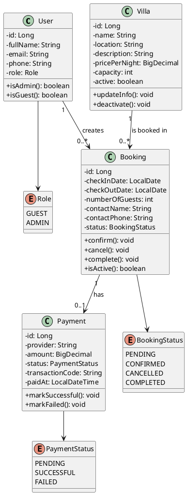

# 05 - Class Diagram Description

## Purpose

This document describes the class diagram of the VStay Villa Booking System.

The class diagram focuses on the main domain classes used by the system: User, Villa, Booking, and Payment. It also shows the basic status and role enums needed to support booking, payment, guest, and admin requirements.

The diagram is kept simple so it can support the previous use case and package diagrams without going deeper into technical implementation layers.

---

# Related Use Cases

| Use Case ID | Use Case Name | Related Class |
|---|---|---|
| UC-01 | View Villas | Villa |
| UC-02 | Search and Filter Villas | Villa, Booking |
| UC-03 | View Villa Details | Villa |
| UC-04 | Create Booking | User, Villa, Booking |
| UC-05 | View Booking Details | Booking, Villa, User |
| UC-06 | Cancel Booking | Booking, BookingStatus |
| UC-07 | Make Payment | Booking, Payment, PaymentStatus |
| UC-08 | View Payment Status | Payment, PaymentStatus |
| UC-09 | Create Villa | Villa |
| UC-10 | Update Villa | Villa |
| UC-11 | Delete Villa | Villa, Booking |
| UC-12 | View Villa List | Villa |
| UC-13 | View All Bookings | Booking |
| UC-14 | Update Booking Status | Booking, BookingStatus |

---

# AI Prompt Used

```text
Create a simple UML class diagram for a villa booking management system.

The system includes:
- Guests and admins
- Villas
- Bookings
- Payments
- Booking status and payment status

Only include the main domain classes, their basic attributes, simple methods, enum values, and relationships.
Do not include technical implementation layers.
Generate the diagram using PlantUML.
Keep it suitable for a university software engineering assignment.
```

---

# AI Generated UML Code



---

# UML Diagram Image

```text
assets/class-diagram.png
```

---

# Short Explanation

The class diagram shows the core data model of VStay.

`User` represents both guests and admins through the `Role` enum. Guests create bookings, while admins manage villa and booking information according to the use case diagram.

`Villa` stores villa information such as name, location, description, price, capacity, and active status. It supports villa browsing, searching, filtering, and admin villa management.

`Booking` connects a guest user with a villa for a selected date range. It stores guest count, contact information, and booking status. The booking status follows the documented values: pending, confirmed, cancelled, and completed.

`Payment` belongs to one booking and stores simplified payment information. Its status follows the documented values: pending, successful, and failed.

The diagram stays at the domain level and does not include implementation-layer classes, because those classes were already represented in the package diagram.

---
