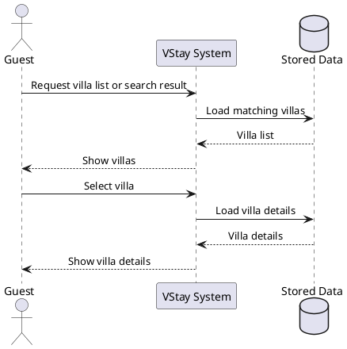
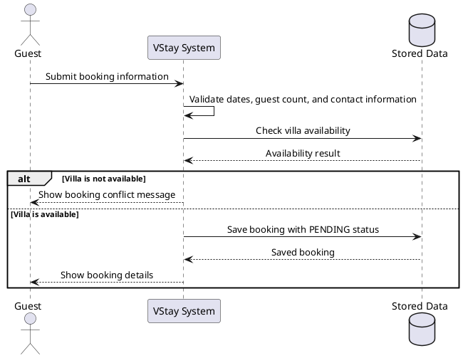
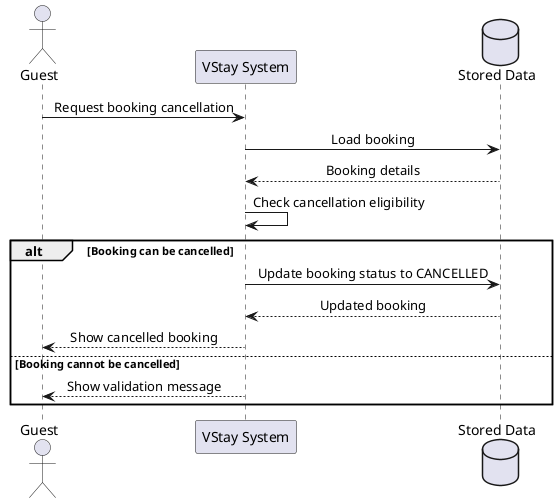
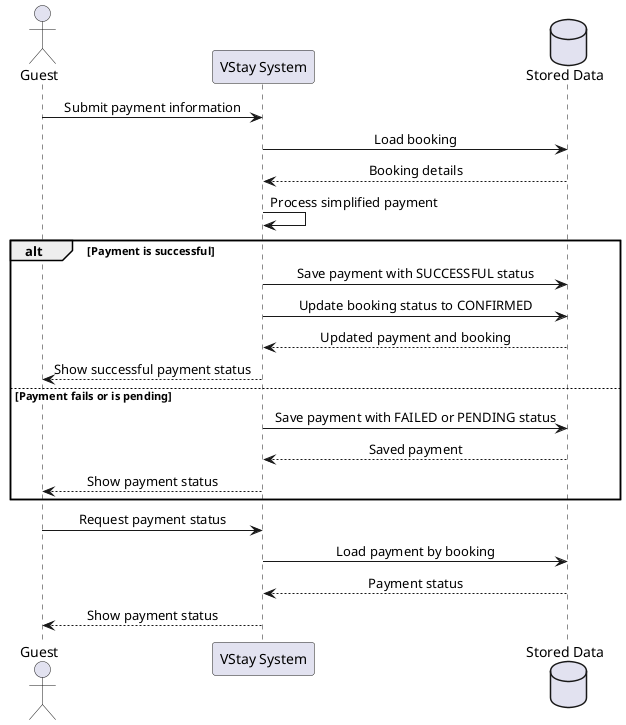
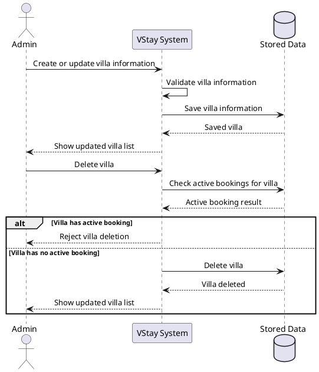
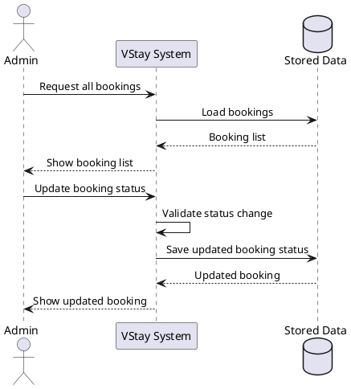

# 06 - Sequence Diagram Description

## Purpose

This document describes the sequence diagrams of the VStay Villa Booking System.

Instead of using one large sequence diagram, the system behavior is separated into smaller diagrams. Each diagram focuses on one main action or workflow from the use case diagram.

This keeps the diagrams simple, readable, and consistent with the earlier use case diagram, package diagram, and class diagram.

---

# Related Use Cases

| Diagram | Related Use Cases | PlantUML File |
|---|---|---|
| Browse and View Villas | UC-01, UC-02, UC-03 | `docs/uml/sequence-diagram-browse-villas.puml` |
| Create Booking | UC-04, UC-05 | `docs/uml/sequence-diagram-create-booking.puml` |
| Cancel Booking | UC-06 | `docs/uml/sequence-diagram-cancel-booking.puml` |
| Make Payment and View Payment Status | UC-07, UC-08 | `docs/uml/sequence-diagram-payment.puml` |
| Admin Manage Villas | UC-09, UC-10, UC-11, UC-12 | `docs/uml/sequence-diagram-admin-manage-villas.puml` |
| Admin Manage Bookings | UC-13, UC-14 | `docs/uml/sequence-diagram-admin-manage-bookings.puml` |

---

# AI Prompt Used

```text
Create simple UML sequence diagrams for a villa booking management system.

Actors:
- Guest
- Admin

Separate the sequence diagrams by action:
- Guest browses, searches, and views villas
- Guest creates a booking
- Guest cancels a booking
- Guest makes a payment and views payment status
- Admin manages villas
- Admin views bookings and updates booking status

Keep each diagram high-level and business-focused.
Do not include technical implementation layers.
Generate the diagrams using PlantUML.
```

---

# AI Generated UML Code

## Browse and View Villas



## Create Booking



## Cancel Booking



## Make Payment and View Payment Status



## Admin Manage Villas



## Admin Manage Bookings



---

# UML Diagram Images

```text
assets/sequence-diagram-browse-villas.png
assets/sequence-diagram-create-booking.png
assets/sequence-diagram-cancel-booking.png
assets/sequence-diagram-payment.png
assets/sequence-diagram-admin-manage-villas.png
assets/sequence-diagram-admin-manage-bookings.png
```

---

# Short Explanation

The sequence diagrams are separated by action to keep each workflow clear.

The guest diagrams cover villa browsing, booking creation, booking cancellation, payment submission, and payment status viewing.

The admin diagrams cover villa management and booking status management.

Each diagram stays at the business level by showing the actor, the VStay system, and stored data. This matches the simple class diagram while still covering all use cases from UC-01 to UC-14.

---
