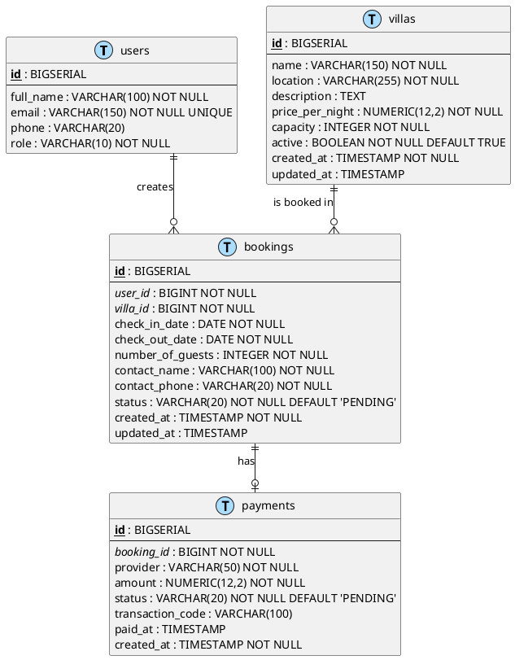

# 07 — Database Schema Description

## Purpose

This document describes the database schema of the VStay Villa Booking System.

The database schema defines the persistent storage structure for the system. It maps the domain classes from the class diagram into relational database tables using PostgreSQL as the target database engine.

The schema supports all use cases defined in the use case diagram, including villa browsing, booking management, payment processing, and admin management.

---

# Related Use Cases

| Use Case ID | Use Case Name | Related Table |
|---|---|---|
| UC-01 | View Villas | villas |
| UC-02 | Search and Filter Villas | villas, bookings |
| UC-03 | View Villa Details | villas |
| UC-04 | Create Booking | users, villas, bookings |
| UC-05 | View Booking Details | bookings, villas, users |
| UC-06 | Cancel Booking | bookings |
| UC-07 | Make Payment | bookings, payments |
| UC-08 | View Payment Status | payments |
| UC-09 | Create Villa | villas |
| UC-10 | Update Villa | villas |
| UC-11 | Delete Villa | villas, bookings |
| UC-12 | View Villa List | villas |
| UC-13 | View All Bookings | bookings |
| UC-14 | Update Booking Status | bookings |

---

# AI Prompt Used

```text
Create a database Entity-Relationship Diagram for a villa booking management system using PostgreSQL.

The system includes:
- Users (guests and admins)
- Villas
- Bookings
- Payments

Include primary keys, foreign keys, data types, constraints, and relationships.
Use PostgreSQL-specific data types such as BIGSERIAL, VARCHAR, TEXT, NUMERIC, INTEGER, BOOLEAN, DATE, and TIMESTAMP.
Generate the diagram using PlantUML.
Keep it suitable for a university software engineering assignment.
```

---

# AI Generated UML Code



---

# Table Descriptions

## users

Stores user account information for both guests and admins.

| Column | Type | Constraints | Description |
|---|---|---|---|
| id | BIGSERIAL | PRIMARY KEY | Auto-generated user identifier |
| full_name | VARCHAR(100) | NOT NULL | User's full name |
| email | VARCHAR(150) | NOT NULL, UNIQUE | User's email address, used for identification |
| phone | VARCHAR(20) | | User's phone number |
| role | VARCHAR(10) | NOT NULL | User role: GUEST or ADMIN |

## villas

Stores villa information managed by admins and browsed by guests.

| Column | Type | Constraints | Description |
|---|---|---|---|
| id | BIGSERIAL | PRIMARY KEY | Auto-generated villa identifier |
| name | VARCHAR(150) | NOT NULL | Villa name |
| location | VARCHAR(255) | NOT NULL | Villa location or address |
| description | TEXT | | Detailed villa description |
| price_per_night | NUMERIC(12,2) | NOT NULL | Villa price per night in local currency |
| capacity | INTEGER | NOT NULL | Maximum number of guests the villa can hold |
| active | BOOLEAN | NOT NULL, DEFAULT TRUE | Whether the villa is currently active and available |
| created_at | TIMESTAMP | NOT NULL | Record creation timestamp |
| updated_at | TIMESTAMP | | Last update timestamp |

## bookings

Stores booking records created by guests for specific villas.

| Column | Type | Constraints | Description |
|---|---|---|---|
| id | BIGSERIAL | PRIMARY KEY | Auto-generated booking identifier |
| user_id | BIGINT | NOT NULL, FK → users(id) | The guest who created the booking |
| villa_id | BIGINT | NOT NULL, FK → villas(id) | The villa being booked |
| check_in_date | DATE | NOT NULL | Booking check-in date |
| check_out_date | DATE | NOT NULL | Booking check-out date (must be after check-in) |
| number_of_guests | INTEGER | NOT NULL | Number of guests for the booking |
| contact_name | VARCHAR(100) | NOT NULL | Guest contact name |
| contact_phone | VARCHAR(20) | NOT NULL | Guest contact phone number |
| status | VARCHAR(20) | NOT NULL, DEFAULT 'PENDING' | Booking status: PENDING, CONFIRMED, CANCELLED, or COMPLETED |
| created_at | TIMESTAMP | NOT NULL | Record creation timestamp |
| updated_at | TIMESTAMP | | Last update timestamp |

## payments

Stores simplified payment records linked to bookings.

| Column | Type | Constraints | Description |
|---|---|---|---|
| id | BIGSERIAL | PRIMARY KEY | Auto-generated payment identifier |
| booking_id | BIGINT | NOT NULL, FK → bookings(id) | The booking this payment belongs to |
| provider | VARCHAR(50) | NOT NULL | Payment provider name (e.g., MomoPay, VNPay) |
| amount | NUMERIC(12,2) | NOT NULL | Payment amount |
| status | VARCHAR(20) | NOT NULL, DEFAULT 'PENDING' | Payment status: PENDING, SUCCESSFUL, or FAILED |
| transaction_code | VARCHAR(100) | | External transaction reference code |
| paid_at | TIMESTAMP | | Timestamp when payment was completed |
| created_at | TIMESTAMP | NOT NULL | Record creation timestamp |

---

# Relationships

| Relationship | Description | Cardinality |
|---|---|---|
| users → bookings | A user (guest) can create zero or more bookings | One-to-Many |
| villas → bookings | A villa can have zero or more bookings | One-to-Many |
| bookings → payments | A booking can have zero or one payment record | One-to-One (optional) |

---

# Business Rule Constraints

| Rule | Database Constraint |
|---|---|
| BR-01: Villa availability | Application-level check on overlapping bookings for the same villa |
| BR-02: Check-out after check-in | Application-level validation: check_out_date > check_in_date |
| BR-03: Guests ≤ capacity | Application-level validation: number_of_guests ≤ villa.capacity |
| BR-04: Default PENDING status | bookings.status DEFAULT 'PENDING' |
| BR-07: No delete with active booking | Application-level check before villa deletion |
| BR-08: One payment per booking | bookings → payments One-to-One relationship |
| BR-11: Payment status values | Application-level enum validation |
| BR-12: Booking status values | Application-level enum validation |

---

# UML Diagram Image

```text
assets/database-schema.png
```

---

# Short Explanation

The database schema maps the four domain classes from the class diagram into PostgreSQL tables.

The `users` table stores both guest and admin accounts, distinguished by the `role` column. The `villas` table stores villa information with an `active` flag for soft-delete behavior. The `bookings` table connects a user to a villa for a date range and tracks booking status. The `payments` table records simplified payment information linked to one booking.

Foreign keys enforce referential integrity between users, villas, bookings, and payments. Status columns use VARCHAR to store enum values that are validated at the application level, matching the `BookingStatus` and `PaymentStatus` enums from the class diagram.

The schema uses PostgreSQL-specific types such as `BIGSERIAL` for auto-incrementing primary keys, `NUMERIC(12,2)` for monetary values, and `TIMESTAMP` for audit fields.

---
